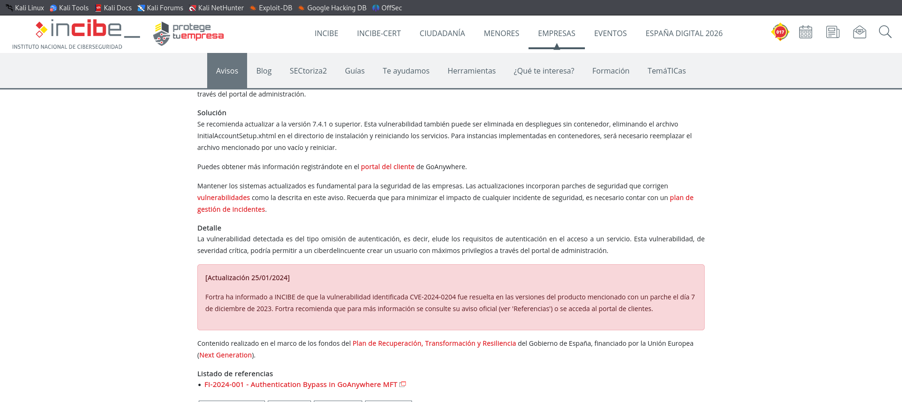
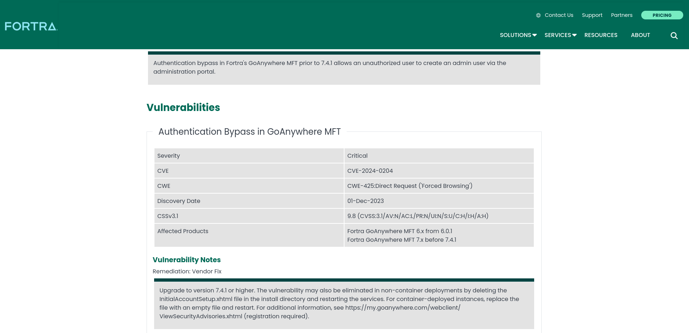
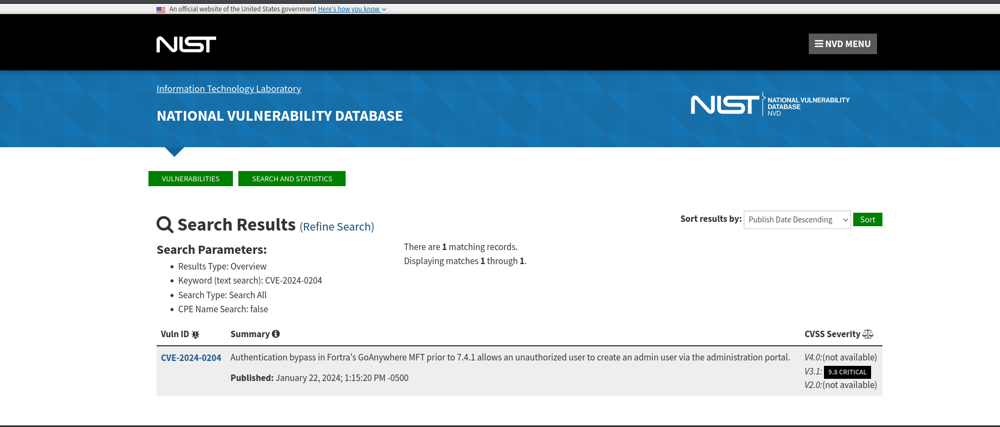
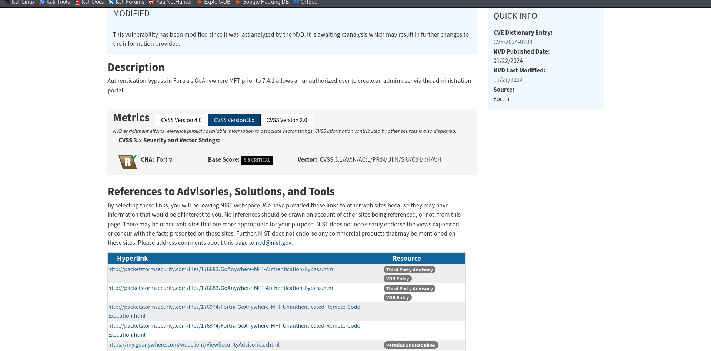
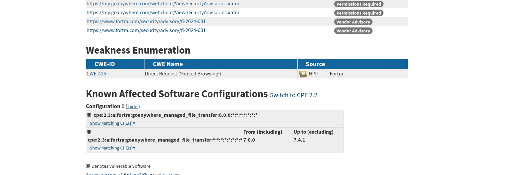
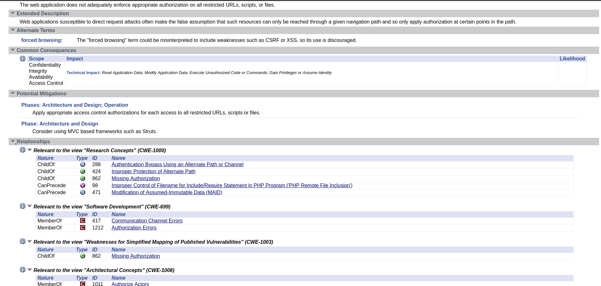
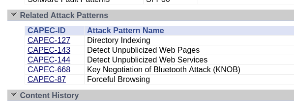
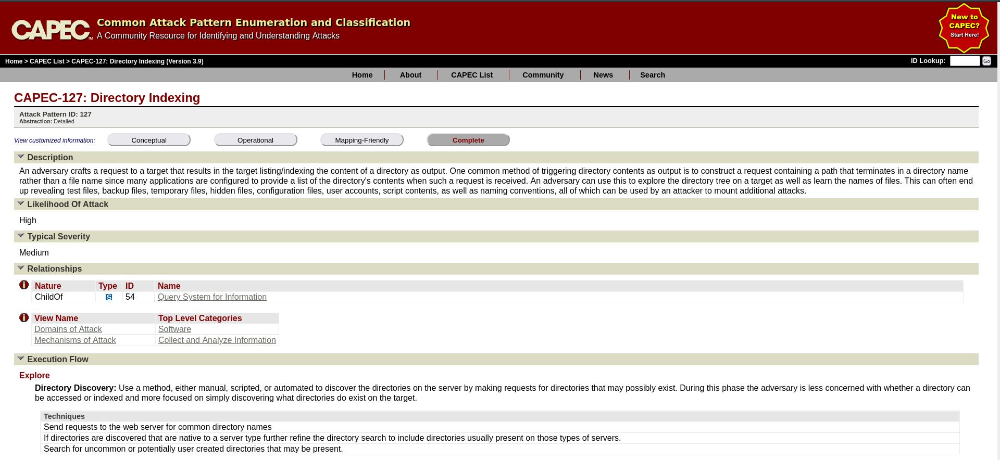
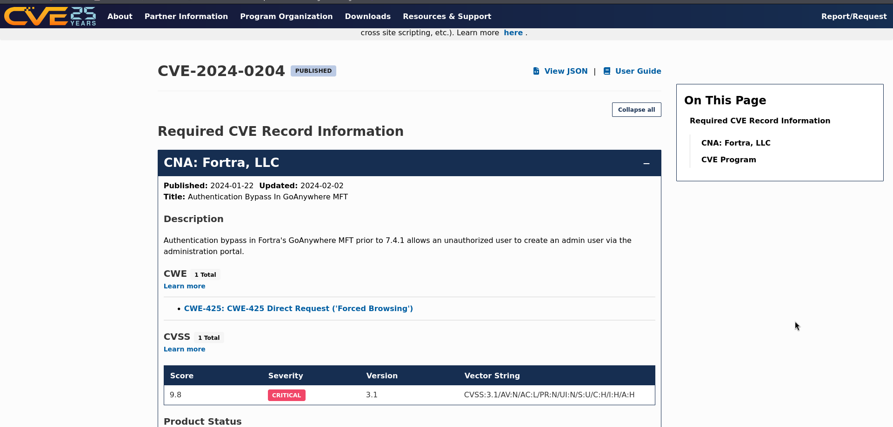

# PPS-Unidad2Actividad1-Ignacio

# Análisis de la vulnerabilidad CVE-2024-0204

## 1. Identificación de la Vulnerabilidad

La vulnerabilidad que vamos a analizar está documentada en el siguiente enlace oficial:

- [Aviso de seguridad de Fortra](https://www.fortra.com/security/advisories/product-security/fi-2024-001)

 

Se trata de una vulnerabilidad de omisión de autenticación en **GoAnywhere MFT de Fortra**, la cual podría permitir a un atacante eludir mecanismos de autenticación y obtener acceso no autorizado a recursos del sistema.

## 2. Identificación del CVE Asociado

Para obtener más detalles sobre esta vulnerabilidad, consultamos las bases de datos especializadas en CVE:

- [Registro CVE en CVE.org](https://www.cve.org/CVERecord?id=CVE-2024-0204)
- [Base de datos NVD](https://nvd.nist.gov/vuln/detail/CVE-2024-0204)

La vulnerabilidad ha sido identificada con el número **CVE-2024-0204**.

## 3. Evaluación de la Criticidad (CVSS)

### Información de la NVD

Según la [entrada en la NVD](https://nvd.nist.gov/vuln/detail/CVE-2024-0204), esta vulnerabilidad ha recibido una puntuación alta en el sistema de clasificación **CVSS**. 

Los factores que influyen en la criticidad de esta vulnerabilidad incluyen:

- **Vector de ataque:** Remoto (a través de la red).
- **Complejidad del ataque:** Baja.
- **Privilegios requeridos:** Ninguno.
- **Interacción del usuario:** No requerida.
- **Impacto en Confidencialidad:** Alto.
- **Impacto en Integridad:** Alto.
- **Impacto en Disponibilidad:** Alto.

Esto sugiere que la vulnerabilidad es crítica y fácilmente explotable por atacantes remotos.

## 4. Identificación de las Debilidades Explotadas (CWE)

La vulnerabilidad está asociada a la siguiente debilidad de seguridad:

- **CWE-425: Omisión de Autenticación Basada en la Interfaz de Usuario**
  - Más información: [CWE-425 en Mitre](https://cwe.mitre.org/data/definitions/425.html)

  
Esta debilidad ocurre cuando una aplicación no verifica adecuadamente los controles de autenticación, lo que permite a los atacantes acceder a recursos sin credenciales válidas.

## 5. Identificación del Patrón de Ataque (CAPEC)

El patrón de ataque identificado para esta vulnerabilidad es:

- **CAPEC-87: Omisión de Autenticación**
  - Más información: [CAPEC-87 en Mitre](https://capec.mitre.org/data/definitions/87.html)

  
Este patrón describe los ataques en los que los controles de autenticación son eludidos o manipulados, permitiendo acceso no autorizado.

## 6. Descarga del Registro CVE

Podemos acceder al registro CVE en formato JSON desde el siguiente enlace:

- [Descargar JSON de CVE-2024-0204](https://www.cve.org/CVERecord?id=CVE-2024-0204)

Este archivo contiene información estructurada que puede ser utilizada por herramientas de seguridad automatizadas.

---

Este análisis proporciona una visión clara de la vulnerabilidad **CVE-2024-0204**, su criticidad, debilidades explotadas y posibles ataques que pueden aprovecharla. Es importante aplicar las actualizaciones y parches recomendados por Fortra para mitigar el riesgo.

